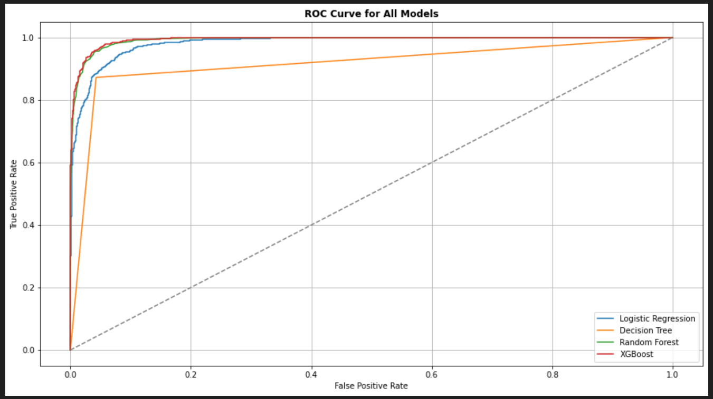

# Air Quality Classification Using Machine Learning

## Problem Statement

Air pollution severely affects both environmental integrity and public health. This project focuses on building a classification model that predicts air quality levels (Good, Moderate, Poor, Hazardous) using both environmental (e.g CO, NO₂, SO₂) and demographic (e.g population density, proximity to industrial zones) data.

## Objectives

- Preprocess and clean the dataset (handle missing values, outliers).

- Perform exploratory data analysis (EDA) to understand variable relationships.

- Train machine learning models (Logistic Regression,Decision Trees Random Forest).

- Improve model performance through class balancing (SMOTE) and hyperparameter tuning.

- Interpret feature importance and model insights.

- Provide policy-oriented recommendations.

## Technologies Used

- Python

- Pandas, NumPy

- Matplotlib, Seaborn

- Scikit-learn

- SMOTE (for class balancing)

## Key Visualizations

**Class Distribution Before SMOTE**

Illustrated the class imbalance.

**Correlation Heatmap**

Highlighted the strongest relationships between variables (e.g., CO, NO₂ positively correlated with poor air quality).

**Feature Importance Plot (Decision Trees)**

Ranked Proximity to Industrial Areas, CO, and NO₂ as the top predictors of poor air quality.

**Confusion Matrix**

Illustrates the classification performance for each air quality category. Diagonal values represent correct predictions, while off-diagonal values indicate misclassifications. This helps assess how well the model distinguishes between “Good,” “Moderate,” “Poor,” and “Hazardous” air quality.

**ROC Curves (Receiver Operating Characteristic)**

ROC curves were used to evaluate the performance of the multi-class classifier. They illustrate the trade-off between true positive rate and false positive rate for each air quality category. Higher AUC values indicate strong discriminative power of the model across classes.

**Classification Report Metrics**

High precision/recall for Good and Poor classes. Moderate and Hazardous were slightly less reliable, indicating areas for refinement.

## Model Performance

- Overall accuracy: - 90%

- F1-score (macro avg): - 85%

- Strong performance for Good and Poor categories.

- Applied SMOTE for class balancing.

- Added class weights and sampling in Random Forest for penalization.

## Insights

- Top predictors: CO, NO₂, SO₂, and Proximity to Industrial Areas.

- PM2.5 was surprisingly less influential, possibly due to local data conditions or multicollinearity.

- Urban and industrial regions require stricter monitoring and zoning.

## Recommendations

- Deploy sensors in traffic-heavy and industrial areas to track top pollutants.

- Enforce emissions policies targeting CO and NO₂ sources.

- Avoid residential zoning near high-risk industrial zones.

- Public awareness campaigns on air quality hazards.

## Next Steps

- Try ensemble models (e.g XGBoost, AdaBoost).

- Incorporate time-series data for forecasting.

- Use PCA or advanced feature engineering for model simplification.